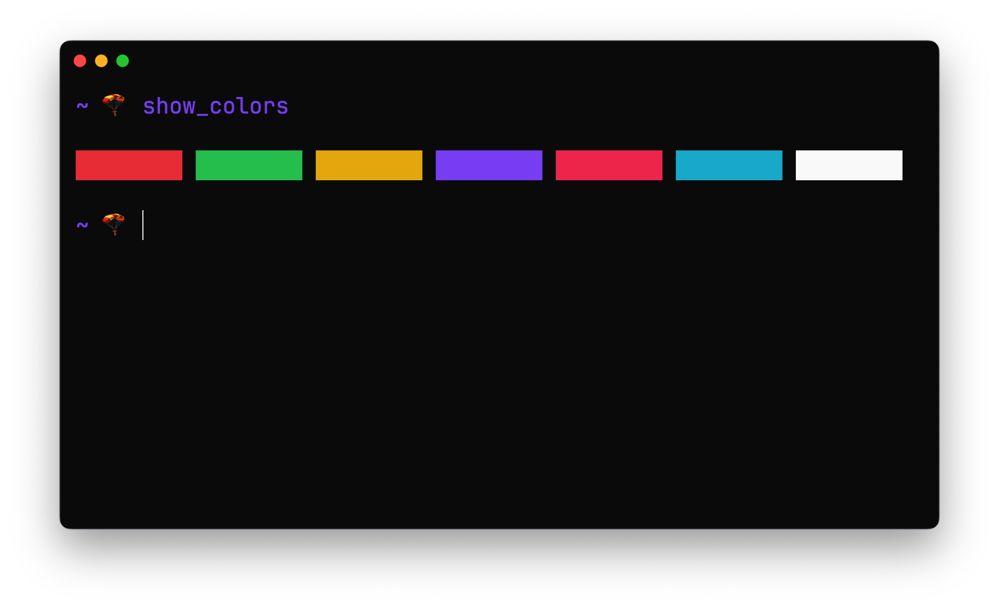

# hyper-purple

> hyper purple dark theme



## Install

```bash
hyper install hyper-purple
```

## extra settings

```bash
fontSize: 16,
fontFamily: '"JetBrains Mono", Monaco, "Menlo", "Ubuntu Mono", "Droid Sans Mono", "Consolas", monospace',
shell: '/usr/local/bin/fish',
cursorShape: 'BEAM',
cursorBlink: true,
webGLRenderer: false, // disable WebGL renderer for support ligatures, refer to https://github.com/vercel/hyper/issues/7334
disableLigatures: false,  // enable ligatures
```

## License

MIT © [LinQing](https://github.com/linqing24)
